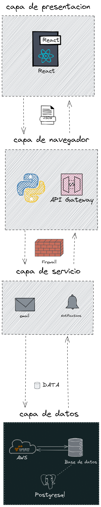
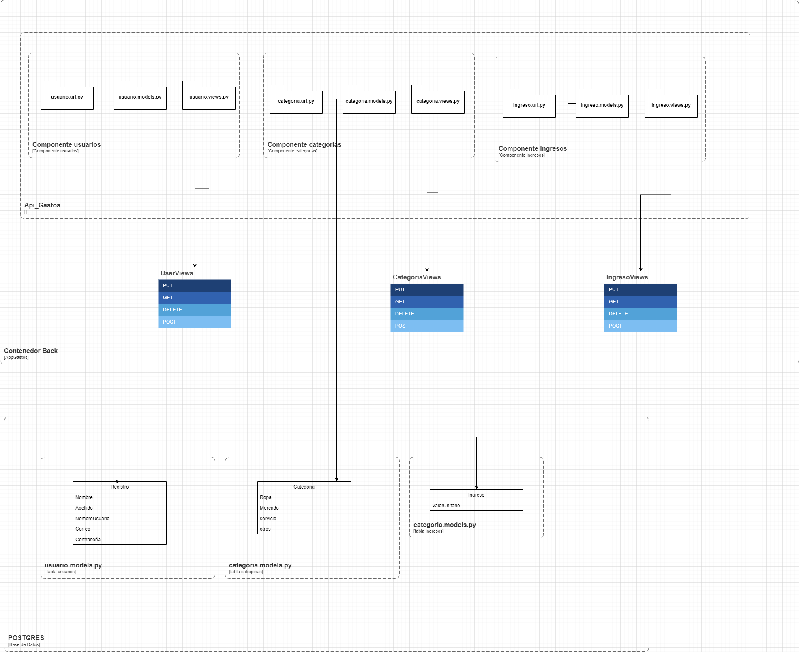
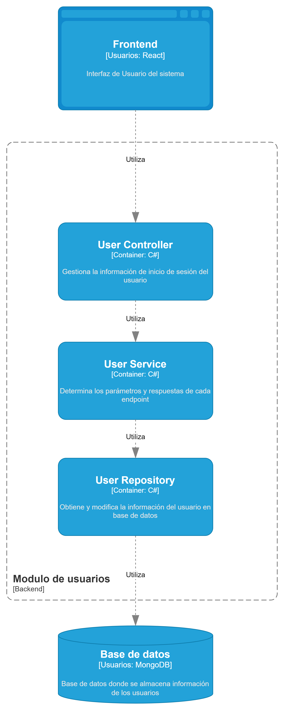
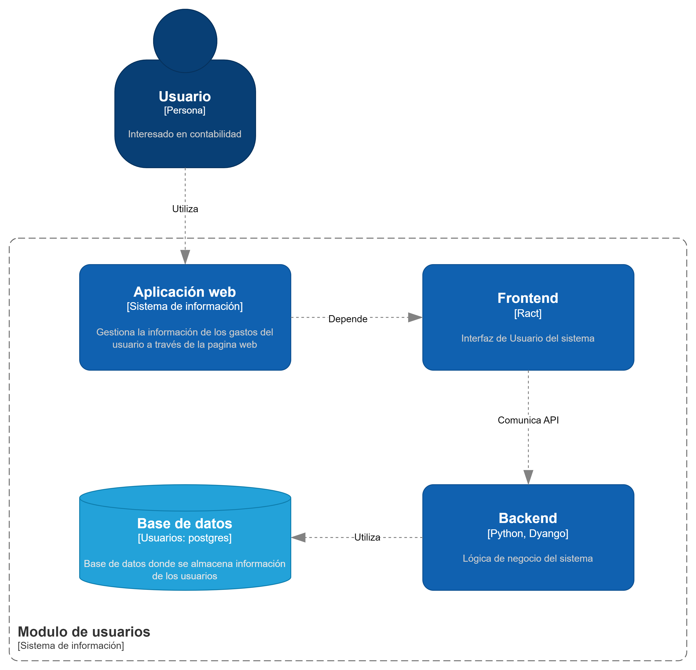
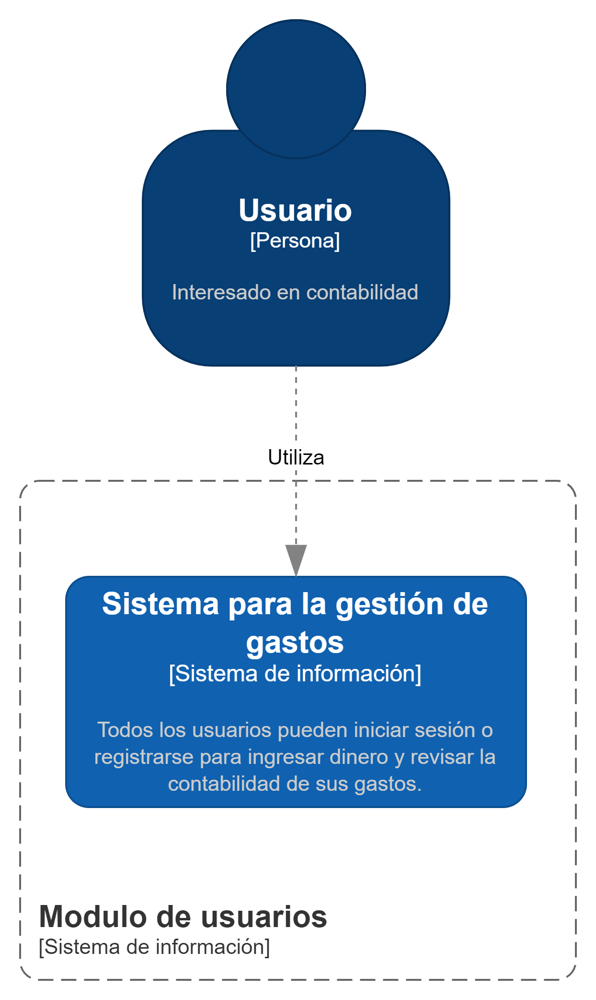

# Sistema de Gastos 📚

## Descripción 📋

La aplicación de gastos consiste en poder llevar el control de las cuentas de cada mes, donde contará con un registro si hace uso de  esta por primera vez, si  es usuario de la página le dará el acceso con su correo y contraseña (inicio de sesión).
Al loguearse podrá  mirar su monto de cada mes y si no lo ha hecho podrá hacer el debido proceso para colocar el valor de sus ingresos mensualmente para que  con el valor ingresado pueda mirar y llevar el registro  de sus ingresos y egresos.

ya al haber puesto el monto de su ingreso que va a consumir en el mes podrás mirar o observar que le dará opciones donde podrá ir colocando en que se gastando  durante el mes, tendrá un apartado donde puede colocar en que  se ha gastado si en ropa, mercado u otras cosas, más el monto de lo que gastaste.
Al finalizar el mes este tendrá un apartado donde le dará un balance de los gastos que hicieron o comúnmente se dice un reporte mensual.

## Tabla de Contenido 📄

1. [Arquitectura](#architecture)
2. [Instalación](#installation)
3. [Modo de Uso](#usage)
4. [Base de Datos](#database)
5. [Tecnlogias](#technologies)
6. [Autores](#authors)
7. [Licencia](#license)

## Arquitectura 🛠️

### Diseño de la Arquitectura ✒️
<!-- img -->


## Diagrama de Clases ✒️



## Diagrama de Componentes ✒️



## Diagrama de Contenedores ✒️



## Diagrama de Contexto ✒️



## Instalación 🔧

### Requisitos del proyecto 🪛

- Python 3.10
- XAMPP(para pruebas locales)
- Postman(para pruebas locales de la API)
- PostgreSQL
- AWS (para despliegue en la nube)
- Node.js

### Pasos de Instalación 🪜

1. **Clonar el repositorio del Backend**

```bash
# Clonar el repositorio
$ git clone https://github.com/Manuekle/gastos-back
$ cd Backend
# Instalar el entorno virtual
$ pip install virtualenv
$ python -m virtualenv env
# Activar el entorno virtual en Linux
$ source env/bin/activate
# Activar el entorno virtual en Windows
$ env\Scripts\activate
# Instalar las dependencias
$ cd backend
$ pip install -r requirements.txt
# Solo si se tiene cuenta en AWS y ya se tiene configurado el Settings.py
$ python manage.py collectstatic
# Para migrar las tablas a la base de datos
$ python manage.py makemigrations
$ python manage.py migrate
# Correr proyecto
$ python manage.py runserver
```

**⚠️** Para correr el proyecto en modo de desarrollo, se debe tener instalado XAMPP o PostgreSQL y crear una base de datos llamada `test` en el phpmyadmin o en el pgadmin respectivamente.

**🎉** Para correr el proyecto en modo de producción, se debe tener una cuenta en AWS y crear una instancia de RDS con PostgreSQL y de igual manera crear una base de datos llamada `test`, para luego configurar las variables de entorno en el archivo `.env` del proyecto.

**💊** Tips del proyecto:

- Configurar las variables de entorno, puede seguir este [tutorial](https://www.youtube.com/watch?v=IolxqkL7cD8).
- Crear Base de Datos en AWS, puede seguir este [tutorial](https://www.youtube.com/watch?v=KngM5bfpttA).
- Crear Bucket en AWS, puede seguir este [tutorial](https://www.youtube.com/watch?v=e6w9LwZJFIA).

```bash
# Variables de entorno
# Para PostgreSQL
DB_ENGINE=django.db.backends.postgresql_psycopg2
# Para MySQL
DB_ENGINE=django.db.backends.mysql
DB_NAME=name_database
DB_USER=user_database
DB_PASSWORD=password_database
# localhost
DB_HOST=localhost
# o la ip local
DB_HOST=127.0.0.1
# MySQL PORT
DB_PORT=3306
# PostgreSQL PORT
DB_PORT=5432

AWS_ACCESS_KEY_ID=your_access_key_id
AWS_SECRET_ACCESS_KEY =your_secret_access_key
AWS_STORAGE_BUCKET_NAME =your_bucket_name
```

```python
# settings.py

# Base de datos
DATABASES = {
    'default': {
        'ENGINE': env('DB_ENGINE'),
        'NAME': env('DB_NAME'),
        'USER': env('DB_USER'),
        'PASSWORD': env('DB_PASSWORD'),
        'HOST': env('DB_HOST'),
        'PORT': '5432'
    }
}

# AWS settings
AWS_ACCESS_KEY_ID = env("AWS_ACCESS_KEY_ID")
AWS_SECRET_ACCESS_KEY = env("AWS_SECRET_ACCESS_KEY")
AWS_STORAGE_BUCKET_NAME = env("AWS_STORAGE_BUCKET_NAME")
AWS_S3_CUSTOM_DOMAIN = f'{AWS_STORAGE_BUCKET_NAME}.s3.amazonaws.com'
AWS_DEFAULT_ACL = 'public-read'
AWS_S3_OBJECT_PARAMETERS = {
    'CacheControl': 'max-age=86400',
}
AWS_LOCATION = 'static'
AWS_QUERYSTRING_AUTH = False
AWS_HEADERS = {
    'Access-Control-Allow-Origin': '*',
}

# No olvide restablecer la conexión de la base de datos y ocultar la contraseña

# Almacena los archivos estáticos en S3 en la carpeta "static"

DEFAULT_FILE_STORAGE = 'storages.backends.s3boto3.S3Boto3Storage'
STATICFILES_STORAGE = 'storages.backends.s3boto3.S3Boto3Storage'

STATIC_URL = f'https://{AWS_S3_CUSTOM_DOMAIN}/static/'
MEDIA_URL = f'https://{AWS_S3_CUSTOM_DOMAIN}/images/'
```

## Base de Datos 💽

## Tecnlogias 🧰

En este proyecto se usaron las siguientes tecnologias:

- [PostgreSQL](https://www.postgresql.org/): Sistema de gestión de base de datos relacional.
- [Python](https://www.python.org/): Version 3.10.7
- [React](https://reactjs.org/): Version 18.2.0
- [Django](https://www.djangoproject.com/): Version 4.1.0
- [TailwindCSS](https://tailwindcss.com/): Version 3.1.8
- [Postman](https://www.postman.com/): Version 9.1.5

## Contribuciones 🖇️

```bash
# Materia: Creditos Libres II
$ Manuel Esteban Erazo
$ Lina Marcela Lizcano 
$ Deybison Stiven Perez Bojorge
```

## Licencia MIT ⚖️

Este proyecto está bajo la Licencia (MIT) - mira el archivo [LICENSE.md](LICENSE.md) para detalles

***
